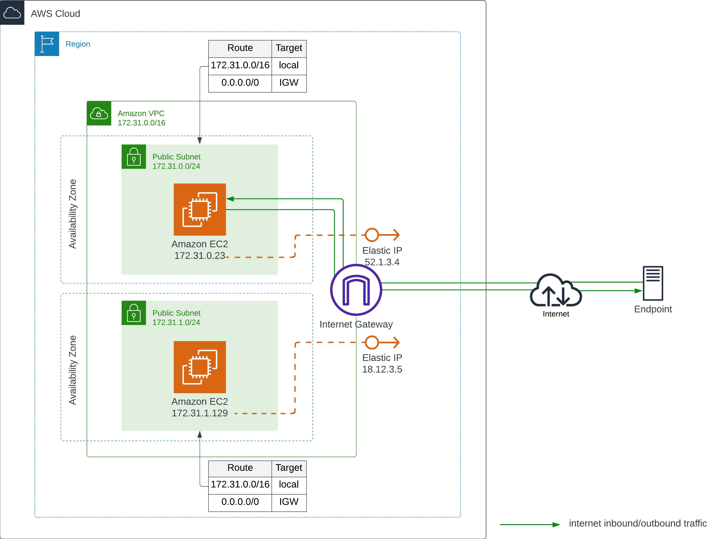

# Introduction to Cloud Computing Using Amazon EC2

Introduir la computacio al nuvol emprant Amazon EC2

### Task 0: Download user-data.txt
- Descarrega al teu ordinador el següent fitxer del repositori de github:
- 
/home/jmmol/github/gsn-ifc31/AWS/EC2-firststeps/user-data.txt
### Task 1: Open AWS Console
1. Accedir a AWS Academy en concret a Academy Learner Lab.
2. Launch AWS Academy Learner Lab
3. Click Start Lab and Open AWS Console to begin.

The objective is to launch two EC2 instances within the same region, but in different availability zones. Both instances will publish a web service that will be accessible via an Elastic IP (public IP).

AWS diagram

### Task 2: VPC Preparation
1. Check that a default VPC has been created.
2. Go to ***Your VPCs*** and click on the VPC ID.
3. Click on ***Tags*** and add a tag where the key is `Name` and the value is `VPC-<region name>`.
4. Verify that there are two default subnets created in different availability zones.
5. Access the first subnet.
6. Click on ***Tags*** and add a tag where the key is `Name` and the value is `first-subnet`.
7. Access the second subnet.
8. Click on ***Tags*** and add a tag where the key is `Name` and the value is `second-subnet`.
9. Go to ***Security groups*** click on default security group.
10. Click on ***Inbound rules*** and edit inboundrules.
11. Add rule **HTTP (TCP port 80)** and source anywhere.
12. Add rule **SSH (TCP port 22)** and source anywhere.
13. And Save rules
   
### Task 3: Creating the First EC2 Instance
1. In the top navigation bar search box, type:
**ec2**
1. In the search results, under Services, click ***EC2***.
1. On the ***Dashboard***, click ***Launch instance***.
1. In the ***Name and tags*** section, for Name, type a name that you like, such as `webserver01`.
1. In the ***Application and OS Images*** section, under ***Quick Start***, choose **Amazon Linux**.
1. For ***Amazon Machine Image (AMI)***, on the dropdown list, keep or choose Amazon Linux 2023 AMI.
1. For ***Instance type***, click Compare instance types.
1. In the Instance types section, review the available instances and their associated resources.
1. Choose the `t3.micro` instance type.
1. Review to confirm that the **t3.micro** instance type is selected.
1. For Key pair name, choose `vockey`. 
1. In the ***Network settings*** section, click Edit.
1. For ***VPC***, choose `VPC-<region name>`.
1. For ***Subnet***, choose the `first-subnet`.
1. For ***Security choose*** the **default** security group 
1. In the ***Configure storage*** section, keep the default selection of an 8 GiB gp3 volume. 
1. Click to expand ***Advanced details***.
1. For ***User data**, click Choose file.
1. In the pop-up box (not shown), choose the `user-data.txt` file that you downloaded to your device in an earlier step, and then review the file contents.
1. Review the Summary section.  
1. Click ***Launch instance***. In the success alert, review the message.
1. In the **Instances** section, choose the checkbox to select the available EC2 instance. Wait 2–3 minutes, and then click the section's refresh icon. Confirm that the instance is now running.
1. For the **running instance**, on the Details tab, under Public IPv4 DNS, click the copy icon to copy the provided address.
1. In a new browser tab (or window) address bar, type:
`http://`, paste the DNS address that you just copied and press Enter. On the page, review the details about your instance.

- If you see a connection timeout message when opening the webpage, check that the address begins with http:// and not https://.
- The public DNS and the security group are used to access the instance details that appear on the webpage. The public DNS record translates a domain name to an IP address. The record informs the browser which server to connect to.
- Take a screenshot of the browser

### Task 3: Creating the Second EC2 Instance
- Create the second EC2 instance in the same way as the previous one, but select the `second-subnet`, which belongs to the other availability zone.
- Take a screenshot of the browser